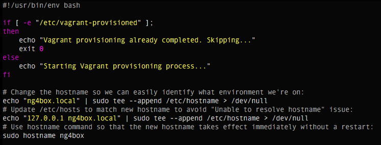
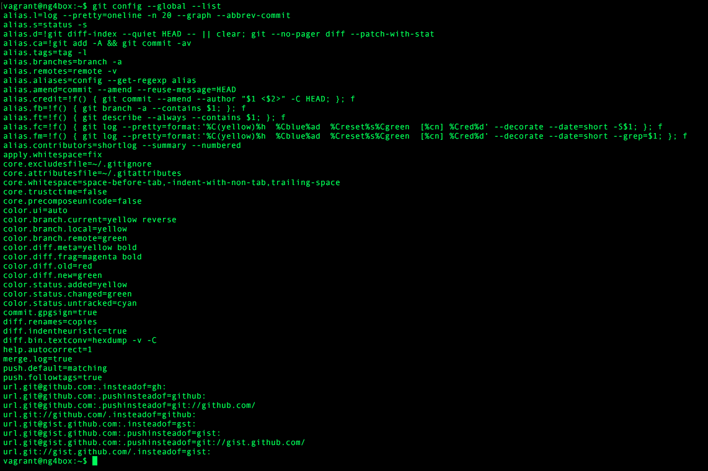

# ng4box

Provisions a clean Ubuntu 14.04.5 LTS 64-bit server instance with all needed to AngularJS 2/4 development 
tools (Node.js, git, vim, typescript, angular-cli) and services (GitHub, Travis-CI).

## Install Vagrant & VirtualBox

### Install Vagrant 1.9
[https://www.vagrantup.com/](https://www.vagrantup.com/)

### Install VirtualBox 5
[https://www.virtualbox.org/wiki/Downloads](https://www.virtualbox.org/wiki/Downloads)

## Setup Options

### Option 1: Box
``` bash
mkdir my-project && cd my-project
vagrant init weberamaral/ng4box
vagrant up
vagrant ssh
```

Done!
For more see: [https://app.vagrantup.com/weberamaral/ng4box](https://app.vagrantup.com/weberamaral/ng4box)

### Option 2: Vagrantfile
``` bash
 git clone git@github.com:weberamaral/ng4box.git
 cd ng4box
 vagrant up
 vagrant ssh
```

Done!

## Post-Setup

### Vagrant user
By default the `vagrant` user is configured with password 'vagrant'. The vagrant user is also configured for 
password-less sudo.

### Edit code on host, build in VM
Your `~/` home directory on your host machine is synced to the `/project/` directory inside of Vagrant. So for example you 
can edit code in `~/code/` on your laptop and build it inside a Vagrant shell inside `/project/code`.

### Networking
Configured for private network on static IP: `192.168.33.10`, with port `:3000` forwarded.
So from a web browser you have two ways of access:

* `localhost:3000`
* `192.168.33.10:3000`

Additionally for convenience, append this line to your /etc/hosts file:
`192.168.33.10 vagrant.localhost`

## Dot files

### Vim


### Git


## Services

### GitHub
``` bash
ssh-keygen -t rsa
(Copy the contents of ~/.ssh/id_rsa.pub into your GitHub account: https://github.com/settings/ssh)
git config --global user.name "<your name>"
git config --global user.email <your email>
```

### Travis-CI
`travis login` or `travis login --pro`

## License
[MIT](LICENSE)

